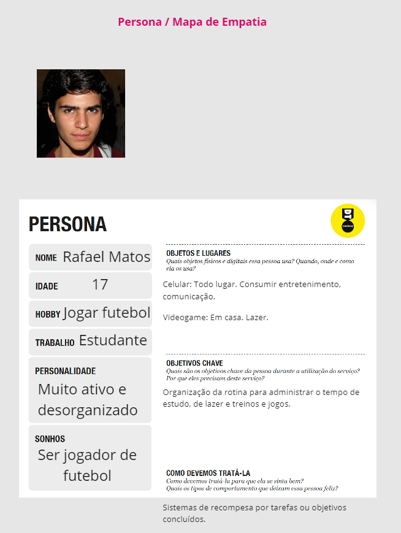
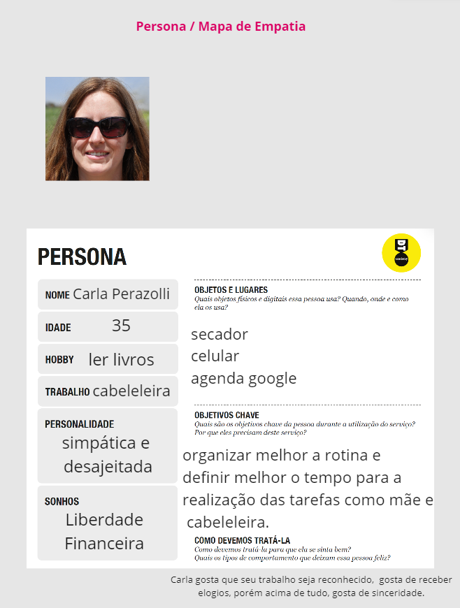
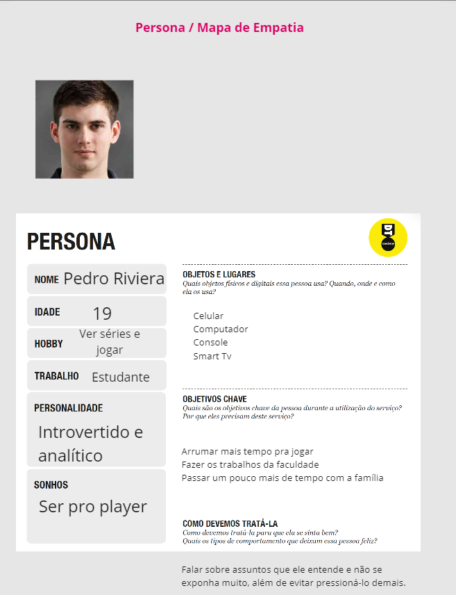
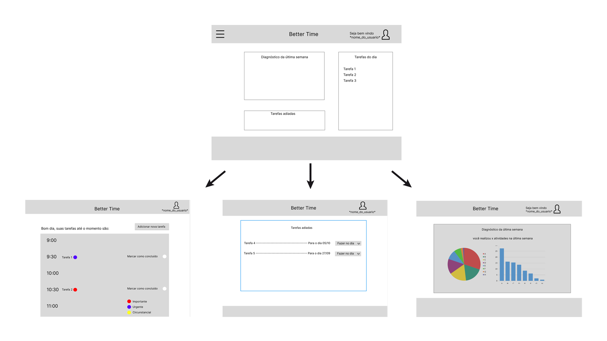
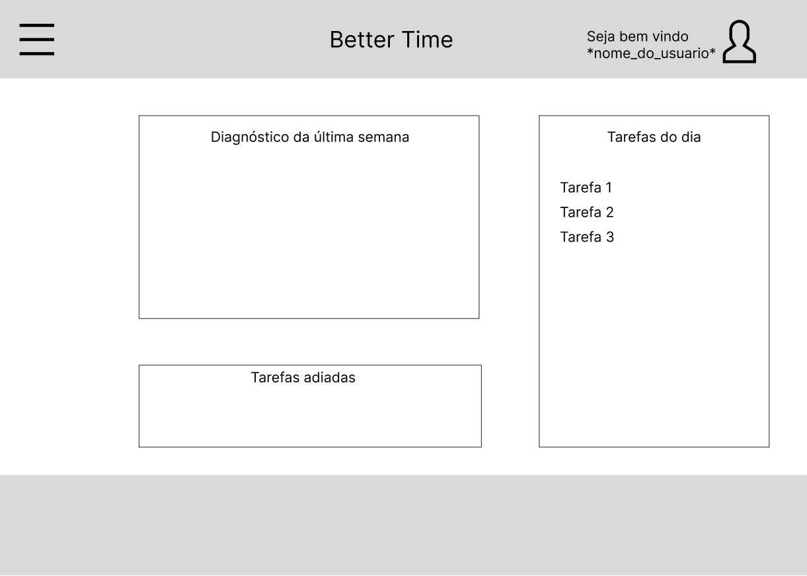

# Informações do Projeto
`TÍTULO DO PROJETO`  

BETTER TIME

`CURSO` 

Trabalho Interdisciplinar: Aplicacões Web | Ciência da Computação | PUC Minas

## Participantes

* Arthur Henrique Figueiredo Cayres Burdignon
* Christopher Carpegiane de Souza Rocha
* Eduarda Silva Santos Nunis
* Felipe Azevedo Junqueira de Carvalho
* Kaio Henrique Lucio e Santos
* Victor Lima Sedlmaier

# Estrutura do Documento

- [Informações do Projeto](#informações-do-projeto)
  - [Participantes](#participantes)
- [Estrutura do Documento](#estrutura-do-documento)
- [Introdução](#introdução)
  - [Problema](#problema) 
  - [Objetivos](#objetivos) 
  - [Justificativa](#justificativa) 
  - [Público-Alvo](#público-alvo) 
- [Especificações do Projeto](#especificações-do-projeto)
  - [Personas e Mapas de Empatia](#personas-e-mapas-de-empatia) 
  - [Histórias de Usuários](#histórias-de-usuários) 
  - [Requisitos](#requisitos) 
    - [Requisitos Funcionais](#requisitos-funcionais)
    - [Requisitos não Funcionais](#requisitos-não-funcionais)
  - [Restrições](#restrições) 
- [Projeto de Interface](#projeto-de-interface)
  - [User Flow](#user-flow)
  - [Wireframes](#wireframes)
- [Metodologia](#metodologia)
  - [Divisão de Papéis](#divisão-de-papéis)
  - [Ferramentas](#ferramentas)
  - [Controle de Versão](#controle-de-versão)
- [Projeto da Solução](#projeto-da-solução)
  - [Tecnologias Utilizadas](#tecnologias-utilizadas)
  - [Arquitetura da solução](#arquitetura-da-solução)
- [Avaliação da Aplicação](#avaliação-da-aplicação)
  - [Plano de Testes](#plano-de-testes)
  - [Ferramentas de Testes (Opcional)](#ferramentas-de-testes-opcional)
  - [Registros de Testes](#registros-de-testes)
- [Referências](#referências)

# Introdução

## Problema

> Falta de organização vem nós gerando diversos problemas. O dia com 24h acaba 
> virando 8h, pois não distribuímos bem os horários. Com o estudo realizado descobrimos 
> que grande 
> parte das pessoas em nossas voltas vivem sem saber organizar 100% o seu tempo. 
> Isso inclui horas de sono, trabalhos, estudos e descanso.  
> Jovens universitários, com estagio que não conseguem fazer um bom proveito do tempo 
> por falta de organização. Com a agenda lotada não distribuem bem o tempo para realizar 
> todas demandas.  
> Recém universitários com a diferença entre escola e faculdade sofrem problemas com 
> organizações de tantos trabalhos/provas. 
> Donas de casa com filhos e afazeres não conseguem se organizar e não sobra tempo para 
> hobbys, e acabam se atrasando em tarefas dos filhos.

## Objetivos

> Auxiliar pessoas com dificuldades em si organizar, aproveitar melhor o tempo em qualquer área da vida. 
> Fazer uma análise das tarefas e distribuir da melhor maneira possível. Estudantes, trabalhadores, 
> donas de casas conseguiram administrar melhor o seu tempo, isso tudo visando um tempo de qualidade.

## Justificativa

> Quando temos uma infinidade de coisas para fazer ao decorrer do dia, acabamos nos exaltando e nos 
> organizamos da pior maneira possível. Calculando as horas de sono, das tarefas e outros deveres 
> conseguiremos achar a distribuição perfeita para cada usuário.

## Público-Alvo

> A princípio estudantes e trabalhadores. Pessoas com as rotinas cheias. Muitas demandas durante ao 
> dia/semana e prezando sempre por aproveitamentos e saúde mental.
 
# Especificações do Projeto

>A partir de de um trabalho de entrevistas qualitativas feitas pelos membros da equipe, foi possível a utilização de várias técnicas para realizar a especificações do >projeto. Nessa seção, essas técnicas serão apresentadas com mais profundidade, sendo elas: elaboração de Personas, Histórias de Usuários, Requisitos e Restrições do >projeto. 

## Personas e Mapas de Empatia

As figuras abaixo identificam as personas propostas na fase de entendimento do problema. 

> **Exemplo de Persona**
> 
> 
> 
> 

## Histórias de Usuários

De acordo com o que foi entendido sobre as características das personas propostas, recolhemos as seguintes histórias de usuários. 

|EU COMO... `PERSONA`| QUERO/PRECISO ... `FUNCIONALIDADE` |PARA ... `MOTIVO/VALOR`                 |
|--------------------|------------------------------------|----------------------------------------|
|Rafael Matos  | Organizar meu tempo de trabalho X estudo X livre.          | Ter tempo para realizar todas as minhas tarefas   |
|Carla Perazolli       | Priorizar as tarefas por importância                 | Fazer as tarefas que são mais importantes para mim primeiro |
|Pedro Riviera       | Poder utilizar o site no meu celular       | Permitir que eu possa administrar meu cronograma em qualquer lugar |
|Rafael Matos      | Ser relembrado das minhas tarefas que precisam ser cumpridas       | Fazer com que eu não esqueça das minhas tarefas facilmente |
|Carla Perazolli       | Ver as tarefas que foram cumpridas ou não na semana e mês | Me motivar a cumprir as minhas tarefas não cumpridas |
|Pedro Riviera      | Poder integrar o site com outros serviços e aparelhos (Smartwatch, Google Calendar, etc)| Permitir introduzir o site na minha rotina, hábitos e serviços |

## Requisitos

As tabelas que se seguem apresentam os requisitos funcionais e não funcionais que detalham o escopo do projeto.

### Requisitos Funcionais

|ID    | Descrição do Requisito  | Prioridade |
|------|-----------------------------------------|----|
|RF-001| Permitir que o usuário cadastre tarefas | ALTA |
|RF-004| Permitir que o usuário edite suas tarefas cadastradas | ALTA | 
|RF-003| Permitir que o usuário identifique as tarefas concluidas | ALTA |
|RF-004| Sistema de priorização de tarefas por importância | ALTA |
|RF-005| Espaço para anotações nas tarefas  | MÉDIA |
|RF-006| Sistema de busca de tarefas  | BAIXA |
|RF-007| Permitir a impressão da rotina do usuário   | BAIXA |

### Requisitos não Funcionais

|ID     | Descrição do Requisito  |Prioridade |
|-------|-------------------------|----|
|RNF-001| Compatibilidade com os navegadores mais utilizados do mercado (Google Chrome, Firefox, Microsoft Edge) |  ALTA | 
|RNF-002| UI fácil de entender e de usar | ALTA | 
|RNF-003| O sistema deve ser responsivo para rodar em um dispositivos móvel | MÉDIA | 
|RNF-004| Integração e cooperação com Smartwatches | MÉDIA | 
|RNF-005| Integração com apps de calendário | MÉDIA | 

## Restrições

O projeto está restrito pelos itens apresentados na tabela a seguir.

|ID| Restrição                                             |
|--|-------------------------------------------------------|
|01| O projeto deverá ser entregue até o final do semestre (04/12/2022)|
|02| O desenvolvimento do site não pode ser terceirizado  |
|03| Não pode ser desenvolvido um módulo de backend        |

# Projeto de Interface

Foi pensado em criar um ambiente mais limpo possivel, com a finalidade de passsar a sensação de tranquilidade para o usuario que acessa, pois muitas vezes no nosso dia temos que fazer tarefas que não nos agrada, portanto um ambiente minimalista e claro ameniza este peso. 

## User Flow

>
> 
> 

## Wireframes

# Metodologia

> Como foi sugerido, utilizamos a metodologia SCRUM e realizamos algumas reuniões semanais,
> além disso criamos grupos no Whatsapp e Discord para podermos discutir nossas ideias em grupo.
>
> Nossas reuniões foram realizad às terças e quintas e nelas foram discutidas as ações a serem
> tomadas.

## Divisão de Papéis

> Arthur Burdignon: Edição do Miro, mapa de stakeholders e matriz CSD
> Christopher Carpegiane: Edição do Miro, pesquisa e relatório técnico
> Eduarda Nunis: Edição do Miro e relatório técnico
> Felipe Azevedo: Edição do Miro e relatório técnico
> Kaio Henrique: Edição do Miro, slides da apresentação e relatório técnico
> Victor Lima: Edição do Miro, wireframes e relatório técnico

## Ferramentas

| Ambiente  | Plataforma              |Link de Acesso |
|-----------|-------------------------|---------------|
|Processo de Design Thinkgin  | Miro | https://miro.com/app/board/uXjVPUzXPvo=/ | 
|Repositório de código | GitHub | https://github.com/ICEI-PUC-Minas-PMGCC-TI/tiaw-pmg-cc-m-20222-04-organizar-dia-a-dia-procrastinacao | 
|Protótipo Interativo | Figma | https://www.figma.com/file/nqcpjQUR3kXDD2C0WnXElR/Better-Time-outras-paginas?node-id=0%3A1 | 

> As ferramentas empregadas no projeto são:
> 
> - Visual Studio Code.
> - Whatsapp
> - Discord
> - Figma
> - Miro
> - GitHub
> 
> O Visual Studio Code foi escolhido porque ele possui uma integração com o
> sistema de versão e também possui uma maior facilidade de aprendizado e 
> é mais leve em quesitos de hardware. As ferramentas de comunicação utilizadas 
> já eram utilizadas anteriormente pelos integrantes do grupo, o que tornou sua
> escolha mais fácil. Por fim, para criar diagramas utilizamos essa ferramenta 
> por melhor captar as necessidades da nossa solução.

## Controle de Versão

> A ferramenta de controle de versão adotada no projeto foi o
> [Git](https://git-scm.com/), sendo que o [Github](https://github.com)
> foi utilizado para hospedagem do repositório `upstream`.
> 
> O projeto segue a seguinte convenção para o nome de branchs:
> 
> - `master`: versão estável já testada do software
> - `unstable`: versão já testada do software, porém instável
> - `testing`: versão em testes do software
> - `dev`: versão de desenvolvimento do software

# Projeto da Solução

> O site desenvolvido pela nossa equipe oferece ao usuário uma variedade
> de ferramentas para auxiliar em sua organização diária. Algumas das
> opções são uma área para anotação de lembretes, um cronograma do
> dia/semana/mês e também uma página de estatísticas para que o mesmo
> possa acompanhar seu progresso.

## Tecnologias Utilizadas

> Para o desenvolvimento do nosso site foi utlizado a IDE VSCode para
> codificar em HTML, CSS e JavaScript. O framework escolhido pra ser
> utilizado foi o Bootstrap. Após fazer cadastro ou login no site, o usuário pode 
> fazer ações como cadastrar tarefas, escrever notas, ver seu progresso como 
> estatísticas, além de poder também nos dar feedback sobre os serviços do site 
> e nos ajudar a melhorar o serviço.

## Arquitetura da solução

> A arquitetura adotada se utiliza principalmente da tarefa cadastrada
> pelo usuário. A mesma é exibida na página principal, além de servir
> como dado para a área de estatística. As notas do usuário seguem uma
> lógica bem parecida, sendo exibidas em sua página própria.
> 
> **Exemplo do diagrama de Arquitetura**:
> 
> 
